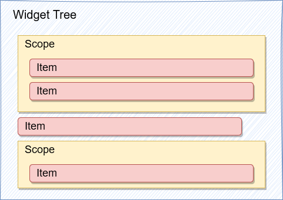
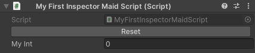
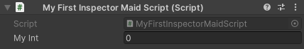
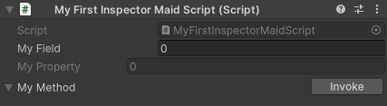
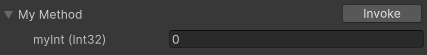
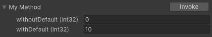
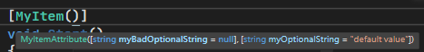

# 功能入門

## 透過 `WidgetAttribute` 描述 `WidgetTree` 來繪製 UI

Inspector Maid 繪製的 UI 主要透過利用由以下 3 種 `WidgetAttribute` 描述對應的功能，並互相協作組合而成。

1. `Item` : 沒有子元素的小部件，例如 `Button`、`HelpBox` 或是欄位本身 `Target`
2. `Scope` : 可以容納有子元素的小部件，例如 `Container` 和 `Foldout`
3. `Styler` : 用於描述小部件風格，例如 `margin`、`padding` 及 `color`。

Inspector Maid 會為每一個目標建立一棵 `WidgetTree`，並根據不同的 `WidgetAttribute` 產生對應的 `Widget` 進行組合。最終組成類似於下圖的結構：



這看起來有點抽象，讓我們來點具體的例子，讓你簡單理解如何使用 Item、Scope 以及 Styler 互相協作以產生想要的 UI 。

假如我希望為我的 `int` 欄位建立一個具有以下特色的 UI

1. 如果 `int` 不為 0 ，在目標欄位之下產生一個按鈕，用來將 `int` 重置為 0
2. 顯示一些幫助資訊用來介紹功能
3. 強調幫助資訊，讓它更醒目一點


讓我們一步一步來完成他:

<details>
<summary>1. 建立一個按鈕用來重置 Int 的值</summary>



首先我們先在 `myInt` 上加入一個 `ButtonAttribute` 以產生一個按鈕。

而為了能讓按鈕重置 `myInt`，我們還需要綁定一個函式，讓按鈕在按下後調用該函式將 `myInt` 歸零。

```cs
[Button("Reset", binding: nameof(ResetValue))]
public int myInt;

public void ResetValue()
{
    myInt = 0;
}
```

</details>

<details>
<summary>2. 將按鈕放到目標欄位之下</summary>

 

一般情況下目標欄位會在所有的 `Widget` 繪製完畢後進行繪製，如果想要提前進行繪製，我們需要使用 `TargetAttribute` 來標註它應該在哪裡繪製。

```cs
[Target]
[Button("Reset", binding: nameof(ResetValue))]
public int myInt;

public void ResetValue()
{
    myInt = 0;
}
```

</details>

<details>
<summary>3. 讓按鈕在 myInt 為 0 時隱藏</summary>




為了在 `myInt` 為 0 時隱藏按鈕，我們需要使用 `HideIfScopeAttribute` 它會偵測綁定的 `bool` 如果為 `true`，便隱藏全部隸屬於他的 `Widget`。

```cs
[Target]
[HideIfScope(binding: nameof(IsMyIntZero))]
[Button("Reset", binding: nameof(ResetValue))]
public int myInt;

private bool IsMyIntZero => myInt == 0;

public void ResetValue()
{
    myInt = 0;
}
```

</details>

<details>
<summary>4. 加入一些幫助資訊</summary>

 

我們可以使用 `HelpBox` 來顯示想呈現的幫助資訊。

```cs
[HelpBox("The button will show If the value is not zero.", HelpBoxMessageType.Info)]
[HelpBox("You can press the button to reset value.", HelpBoxMessageType.Info)]
[Target]
[HideIfScope(binding: nameof(IsMyIntZero))]
[Button("Reset", binding: nameof(ResetValue))]
public int myInt;

private bool IsMyIntZero => myInt == 0;

public void ResetValue()
{
    myInt = 0;
}
```

</details>

<details>
<summary>5. 強調幫助訊息</summary>

 

為了強調幫助訊息我們可以使用 `ContainerScope` (一個空的 Scope) 來將它們包裝起來。並利用 `Style` 來調整它的風格。

由於我們只要強調提示訊息的部分，所以我們在 `Target` 之前使用 `EndScope` 將 Scope 關閉，這樣才不會強調到不相干的 `Widget`。

你可能有發現 `HideIfScope` 並沒有使用 `EndScope` 關閉，這是因為未閉合 Scope 會在所有 `Widget` 被繪製完畢後自動關閉，所以我們可以將其省略掉。

```cs
[ContainerScope, Style(borderRadius: "5", padding: "3", marginVertical: "5", backgroundColor: "#AAAA2040")]
[HelpBox("The button will show If the value is not zero.", HelpBoxMessageType.Info)]
[HelpBox("You can press the button to reset value.", HelpBoxMessageType.Info)]
[EndScope]
[Target]
[HideIfScope(binding: nameof(IsMyIntZero))]
[Button("Reset", binding: nameof(ResetValue))]
public int myInt;

private bool IsMyIntZero => myInt == 0;

public void ResetValue()
{
    myInt = 0;
}
```

</details>

## 如何使用 `Style` 定義 `Widget` 的風格

### 設定風格的屬性

任何型態的屬性都使用 `string` 來進行設定，Inspector Maid 會自動將其轉換成目標數值，如果要調整改屬性請依該屬性的型態作出如下調整：

- `StyleInt` : 使用整數字串 e.g. `"0"`, `"10"`
- `StyleFloat` : 使用浮點字串 e.g. `"0.5"`, `"11.7"`
- `StyleLength` : 使用浮點字串，如果要指定單位則在後面將上對應的符號 e.g. `"13px"`, `"40%"`，如果沒有填入單位的話會使用預設的單位來計算 (px)。
- `StyleColor` : 使用 HexColor 或 RBGA 色彩來設定 e.g. `"#FF0000FF"`, `"0,255,0,255"`，其中 alpha 值是可選項，如果沒有填入則預設為不透明 (FF / 255) e.g. `"#FF0000"`, `"0,255,0"`
- `StyleEnum` : 使用對應 `Enum` 的名稱 e.g. `"row"`, `"column"` ， 也可以使用 nameof 運算式輔助 e.g. `nameof(FlexDirection.Row)`, `nameof(FlexDirection.Column)`。

對於部分高度相關的屬性 (如：`margin`、`padding` 等系列屬性) 我們可以使用速記屬性 (Shorthand Property) 來簡化設定流程。

```cs
[ContainerScope, Style(padding: "10", backgroundColor: "#FF0000")] // all
[ContainerScope, Style(padding: "10 20", backgroundColor: "#00FF00")] // vertical horizontal
[ContainerScope, Style(padding: "10 20 30", backgroundColor: "#0000FF")] // top horizontal bottom
[ContainerScope, Style(padding: "10 20 30 40", backgroundColor: "#AAAA00")] // top right bottom left
[Target, Style(backgroundColor: "#000000")]
public int shorthandProperty = 0;
```

如果不想修改該屬性，可以將對應的參數設為 `null` 來表示不修改。 `null` 這也是參數的預設值，畢竟在設計上不可能每個屬性都要修改。因此在絕大部分情況下你不會使用到 `null`。

### 使用具名指定要指派的參數

在 Style 的建構子中有數十個參數可以指派，依序填入 `null` 直到目標欄位顯然是不明智的；我們可以使用具名參數來直接對該參數進行設定，也可以讓程式碼更具可讀性。

```cs
[Target, Style(null, null, null, null, null, "30")] // Don't do this
public int bad;

[Target, Style(marginTop: "30", paddingLeft: "5")] // Do this
public int good;
```

### 使用 classList 屬性引用在 uss 中預定義的風格

在網頁設計中我們會在 `css` 中定義常用的風格，並在 `HTML` 中引用；在 Inspector Maid 中我們也可以達成類似的效果。

1. 首先我們需要建立一個 `uss` 檔案，你可以透過在 Project 視窗中右鍵選擇 `Create/UI Toolkit/Style Sheet` 來建立。

2. 接著我們要定義風格。 `uss` 的定義方式與 `css` 基本一致，如果有相關經驗的話應該能輕鬆上手。

    ```css
    .width-50-percent {
        width: 50%;
    }

    .height-30-px {
        height: 30px;
    }
    ```

3. 再來我們需要讓 Inspector Maid 知道有哪些 `uss` 可以參考。你可以在 Project Settings 視窗中的 Inspector Maid 分頁中找到 `Import Style Sheets` 欄位，並將目標 `uss` 拖曳至該欄位中以新增參考。

4. 最後我們找到想要引用預定義風格的欄位，並使用 `Style` 中的 `classList` 參數新增目標 class 名稱即可。注意：如果有多個 class 要引用需使用空格進行分隔。

    ```cs
    [Target, Style(classList: "width-50-percent height-30-px")]
    public int styleTest;
    ```

5. 你也可以將 `classList` 與其他屬性混合使用，不過要注意 `classList` 的優先度是最低的，類似於 `HTML` 中 `class` 與 `inline-style` 的關係。

    ```cs
    [Target, Style(classList: "width-50-percent height-30-px", justifyContent: nameof(Align.Center))]
    public int styleTest;
    ```

### 屬性在衝突時的優先級

`Style` 中的部分屬性可能會對同一目標進行重複設定：以 `marginTop` 為例：`marginTop`、`marginVertical`、`marginAll`、`margin` 以及 `classList` 都可能影響到它。

在這時候遵循「選擇越少、目標越單一，優先度越高」的原則進行處理。因此在這種情況下的各屬性的優先級為：
> `marginTop` > `marginVertical` > `marginAll` > `margin` > `classList`

## 在 Inspector 上繪製屬性及函式



經常使用 Unity 的人應該都知道：屬性及函式是無法被繪製到 Inspector 上。這並不難理解，因為 Inspector 本質上就是用來設定序列化資料用的工具視窗。但在實務上我們總有想要監看屬性的當前資料、或是調用特定函式的時候。雖然我們可以利用 `Debug.Log()`、註冊快捷鍵或是使用中斷點等方式達成目的。但這顯然很笨重，也不視覺化。因此我們選擇利用反射來讓屬性及函式可以被呈現在 Inspector 之上，方便監看即調用。

### 如何使用

要顯示屬性或函式其實非常簡單，只需要在其之上使用任意一個 `WidgetAttribute` 即可，實際上你也可以使用它來設計屬性及函式的 UI，就像是欄位一樣。

不過大部分時候你可能只希望顯示該目標而不做任何設計，這時候 `TargetAttribute` 會是你最好的選擇。

```cs
public int myField;

[Target]
private int MyProperty => myField;

[Target]
public void MyMethod()
{
    Debug.Log("Hello, world!");
}
```

### 關於屬性

- 如果你的屬性是只有 getter (read-only)，繪製出的欄位將會被禁用 (無法更改)。
- 如果你的屬性是只有 setter (write-only)，繪製出的欄位將不會追蹤目標的當前值，但當欄位發生改變時會將值賦予到目標上 (這有點危險，謹慎使用)。
- 目前還無法繪製 Array、List 及 Object (不是 UnityEngine.Object)

### 關於函式

- 帶有參數的函式可以透過展開 Foldout 後對顯示的欄位進行調整

    

    ```cs
    [Target]
    public void MyMethod(int myInt)
    {
        Debug.Log($"Yout int: {myInt}");
    }
    ```

- 如果參數有預設值，它也會是對應欄位預設值

    

    ```cs
    [Target]
    public void MyMethod(int withoutDefault, int withDefault = 10)
    {
    }
    ```

## 綁定 (繫結)

部分 `WidgetAttribute` 可以與指定特定欄位讓對應的 `Widget` 與其進行資料綁定，用以完成一些特殊功能。綁定的目標可以是該腳本的物件本身或是該物件下的任何成員。

- 如果要綁定成員，將 `binding` 指派為該成員的名稱以進行綁定。你可以使用 `nameof` 運算式來使程式碼更容易維護。

    ```cs
    [HelpBox(binding: "message")] // Bad
    [HelpBox(binding: nameof(message))] // Good!
    public string message = "Hello World!";
    ```

- 如果要綁定物件本身請使用預先定義的關鍵字 `"this"`

- 依據綁定的成員類型不同，會有不同的回傳邏輯

    1. 欄位：該欄位的數值。
    2. 屬性：該屬性 `getMethod` 的回傳值，如果該屬性沒有 `getMethod` 則無法運行。
    3. 函式：該函式調用後的回傳值，如果該函式有參數則需使用 `args` 定義參數。

        ```cs
        // 如果只有一個參數，可以利用 params 關鍵字的特性，省略 new object[] { ... }
        [HelpBox(binding: nameof(HelloMessage), args: "world")]
        // 如果有多個參數，則必須使用 new object[] { ... } 來包裹
        [HelpBox(binding: nameof(HelloTwoMessage), args: new object[] { "world", "you" })]
        public string message = "";

        public string HelloMessage(string message)
        {
            return $"Hello {message}!";
        }

        public string HelloTwoMessage(string message1, string message2)
        {
            return $"Hello {message1} and {message2}!";
        }
        ```

### 注意事項

- 和傳統 MVVM 模式中使用觀察者模式實作的綁定不同，為了能夠綁定欄位及函式 Inspector Maid 的綁定方式是在該 `Widget` 需要的時候 (通常是在 `OnSceneGUI()` 中) 主動獲得並比較綁定資料，因此會浪費一些效能在處理無效的事件上，且資料更新會有輕微的滯後性 (需等候 `OnSceneGUI()` 被調用或主動使用 `Repaint()` 重繪)。但考慮到本工具只會在 Unity Editor 上運行、以及不需額外的程式碼即可進行資料綁定，我們認為這點缺陷是完全能夠接受的。

- `v1.3.0` 之後資料綁定使用快速反射實作，效能問題應可忽略不計。但資料更新的滯後性仍須注意。

## 自訂小部件

沒有完美的工具，Inspector Maid 雖然提供了許多泛用的内置小部件，但較複雜的設計可能需要大量使用的 `WidgetAttribute` 進行描述才能完成設計，或是内置小部件根本沒有相關的功能。這時後你可以透過自訂小部件，將複雜的 UI 設計定義於一個 `Widget` 中在來提升程式碼的可讀性。以及透過自訂小部件來實作想要的功能。

### 建立 `WidgetAttribute`

1. 首先我們需要建立用來定義 `Widget` 位置及屬性的 `WidgetAttribute`。要注意根據目標功能不同，你需要繼承的類別也有所不同。

    ```cs
    // Item : 單一個小部件
    public class MyItemAttribute : ItemAttribute { }
    // Scope : 可以包裝其他小部件的小部件 (需使用 EndScope 關閉)
    public class MyScopeAttribute : ScopeAttribute { }
    // Styler : 定義前一個小部件的風格
    public class MyStylerAttribute : StylerAttribute { }
    ```

2. 你可能會想要傳入一些參數給 `WidgetAttribute`，我們推薦使用 `readonly field` 以保證其不可變性。

    ```cs
    public class MyItemAttribute : ItemAttribute
    {
        public MyItemAttribute(string myString)
        {
            this.myString = myString;
        }

        public readonly string myString;
    }
    ```

3. 有些參數可能是選擇性的，我們建議使用預設引數來定義預設值，因為它能夠被 IDE 偵測到並顯示。

    ```cs
    public class MyItemAttribute : ItemAttribute
    {
        public MyItemAttribute(string myBadOptionalString = null, string myOptionalString = "default value")
        {
            if(myBadOptionalString != null)
            {
                this.myBadOptionalString = myBadOptionalString;
            }   
            this.myOptionalString = myOptionalString;
        }
        public readonly string myBadOptionalString = "default value";

        public readonly string myOptionalString;
    }
    ```

    

4. 如果想要支援資料綁定，你需要讓該 `WidgetAttribute` 繼承 `IBindable` 介面。為了統一綁定邏輯，我們約定永遠使 `binding` 及 `args` 作為最後兩個參數且 `args` 需使用 `params` 關鍵字。

    ```cs
    public class MyItemAttribute : ItemAttribute, IBindable
    {
        public MyItemAttribute(
            string myString,
            string binding = null,
            params object[] args
            )
        {
            this.myString = myString;
            this.binding = binding;
            this.args = args;
        }

        public readonly string myString;

        public string binding { get; }

        public object[] args { get; }
    }
    ```

### 建立 Drawer / Styler

根據 `WidgetAttribute` 的不同，我們需要繼承的類別也有所不同

#### 繪製器 `WidgetDrawerOf<TAttribute>`

如果你的 `WidgetAttribute` 為 `ItemAttribute` 或是 `ScopeAttribute` 你需要使用 `WidgetDrawerOf<TAttribute>` 進行設計。

```cs
using Naukri.InspectorMaid.Editor.Core;
using Naukri.InspectorMaid.Editor.UIElements;
using UnityEditor.UIElements;

public class MyItemDrawer : WidgetDrawerOf<MyItemAttribute>
{
    public override void OnStart(IWidget widget)
    {
        // 當 Widget 甦醒後，首次 OnSceneGUI() 之前調用此函式
    }

    public override void OnSceneGUI(IWidget widget)
    {
        // 當 Widget 甦醒後，每次 SceneGUI 時調用此函式
    }

    public override void OnDestroy(IWidget widget)
    {
        // 當 Widget 被刪除時調用此函式 (一般為該 component 從 inspector 中消失的時候)
    }
}
```

你可以使用以下屬性及函式來輔助你建立 Drawer

- `attribute` : 用來存取對應的屬性資料
- `memberInfo` : 取得目標的 `MemberInfo`
- `fieldInfo` : 取得目標的 `FieldInfo` ，如果目標不是 field 會拋出錯誤
- `propertyInfo` : 取得目標的 `PropertyInfo` ，如果目標不是 property 會拋出錯誤
- `methodInfo` : 取得目標的 `MethodInfo` ，如果目標不是 method 會拋出錯誤
- `IsBinding` : 判斷該 `Widget` 有綁定欄位
- `GetBindingValue()` : 取得綁定資料，如果取得失敗會拋出對應的錯誤。
- `CreateBindingMethodAction()` : 如果綁定目標是函式，可以使用此函式建立一個會傳入 `args` 參數給綁定函式的委派，這在製作按鈕等需要在特定情境中調用方法的時後很有用。

以 `DisableIfScope` 為例：

```cs
public class DisableIfScopeDrawer : WidgetDrawerOf<DisableIfScopeAttribute>
{
    // 為了擴展功能及封閉一些不常用的函式，我們選擇通過 IWidget 來間接操作 VisualElement，
    // 它包含了絕大部分 VisualElement 常用的函式所以你可以像使用 VisualElement 一般使用它。
    // 如果有函式不包含在內你可以簡單的將它轉型 (widget as VisualElement) 這是絕對安全的。
    public override void OnSceneGUI(IWidget widget)
    {
        // 使用 GetBindingValue 取得綁定資料
        var disable = GetBindingValue<bool>();
        // 如果綁定資料為 true 將 widget 禁用，使其與其子元素無法被操作。
        widget.SetEnabled(!disable);
    }
}
```

#### Styler

```cs
using Naukri.InspectorMaid.Editor.Core;
using UnityEngine.UIElements;

public class MyStyler : CustomStylerOf<MyStylerAttribute>
{
    // style 是目標 Widget 的 style 參考
    public override void OnStyling(IStyle style)
    {
        // 當 Widget 創建完成，且 MyStyler 被建立時調用此函式
    }
}
```

你可以使用以下屬性及函式來輔助你建立 Styler

- `attribute` : 用來存取對應的屬性資料

> 由於 Drawer 和 Styler 會使用到 UnityEditor 中的函式，所以要新增在 Editor 資料夾中使其不再建置時被編譯，否則會專案程式建置。

## 内置小部件

你可以在 package 中的 Sample 中找到所有内置小部件的 demo 以及詳細的說明。
