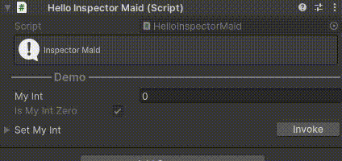
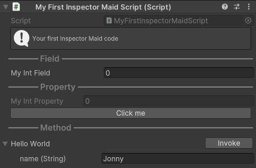

# Inspector Maid



這是一個 Unity Inspector 的 UI 自定義工具。你可以使用他為你的 Component 建立一些簡單的互動功能而不需編寫專屬的 Editor。

Inspector Maid 具有以下幾大特色：

- 使用 UIElement 進行繪製。
- 可以在 Inspector 介面中直接存取屬性和函式。
- 支援為同一目標加入多個裝飾器。
- 可以自訂義專用的裝飾器。
- 可以透過綁定的方式動態修改內容。

## Getting Started

1. 安裝 Unity 2022.3 或以上的版本
2. 在 PackageManager 中點擊左上角的 + 號並選擇 `Add package form git URL...` 然後貼以下網址。
```
https://github.com/naukri7707/InspectorMaid.git
```

## Usage

1. 為腳本引用 InspectorMaid 的命名空間。

```cs
using Naukri.InspectorMaid;
```

2. 為欄位 / 屬性 / 方法上加上目標裝飾器的 Attribute 進行標記

```cs
[HelpBox("My first Inspector Maid code", HelpBoxMessageType.Info)]
[Divider("Field")]
public int myIntField;

[Divider("Property"), Target, Button("Click me", binding: nameof(HelloWorld), args: "Ruby")]
public int MyIntProperty => myIntField;

[Divider("Method")]
public void HelloWorld(string name = "Jonny")
{
    Debug.Log($"Hello {name}!");
}
```

3. 完成！回到 UnityEditor 你會看到以下畫面：




更完整的說明請參考[這裡](./Documentation/Introduction.md)，以及 package 中的範例場景。